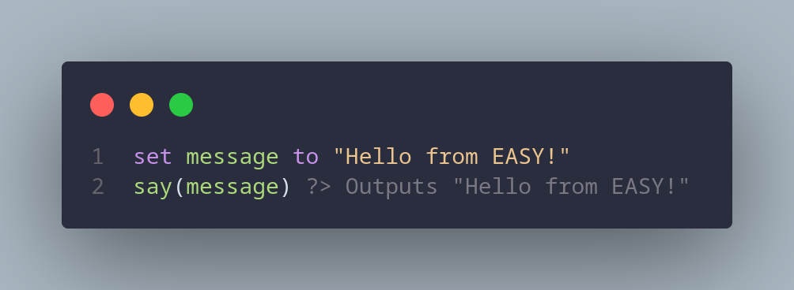

# easy-language
The EASY programming language is a beginner-friendly interpreted language made on Python.


## What is EASY? 

EASY is a simple, intuitive scripting language designed to be human-readable and easy to learn, allowing users to quickly write scripts that are clear and expressive. Its syntax focuses on readability while keeping programming concepts approachable.


---

## Project Overview

EASY is designed with simplicity in mind:

- Readable syntax: Write code almost like plain English.

- Lightweight: Minimal dependencies, easy to integrate into your projects.

- Flexible: Designed to handle scripting, small programs, and prototyping.


Whether you’re a beginner or just want a straightforward scripting language, EASY makes programming more approachable and fun.

---

## Installation

Linux (preferably Arch) is supported with Quick Install: [Installation](https://github.com/tyydev1/easy-language/blob/main/INSTALLATION.md)

---

## Quickstart Example

Here’s a small example of EASY in action:

```esy
set x to 1
if x is 2 then say("Cool ig")
nextif x is 3 then say("Oh, interesting!")
otherwise say("WHAT A REVELATION!")
```

Output:

```
WHAT A REVELATION!
```

Some other example snippets:

```esy
say("Hello, World!")

set name to "Razka"
say("Hello, " + name + "!")

set counter to 0
while counter < 5
    say(counter)
    counter = counter + 1
endwhile
```

---

## Language Reference

### Variables

Declare variables with `set`:

```esy
set x to 5
set name to "Alice"
```

### Conditionals

`if, nextif, otherwise` for branching:

```esy
if x is 10 then say("Ten")
nextif x is 20 then say("Twenty")
otherwise say("Something else")
```

### Loops

`while` loops with end:

```esy
while x < 5
    say(x)
    x = x + 1
end
```

### Functions

`say()` prints to the console. More functions can be added as EASY expands.


### Expressions

Arithmetic: `+, -, *, /`

Comparisons: `is, is not, <, >, <=, >=`

---

## Frequently Asked Questions

### 1. Ini apaan?
Ini adalah bahasa program, seperti Scratch, Python, Arduino, dan contoh lainnya.

### 2. Ini buat apa?
Ini dibuat untuk menulis program.

### 3. Cara pake nya gimana?
Nanti akan dibikin tutorial, untuk sekarang liat [Referensi Bahasa](#language-reference)

---

## Contributing

EASY is open for expansion! You can help by:

- Adding new features

- Improving documentation

- Reporting bugs or issues


Please make sure to follow proper code style and write clear, readable code.


---

## License

EASY is released under the Apache 2.0 license. You can use, copy, or modify the code, but redistribution or commercial use requires permission.


